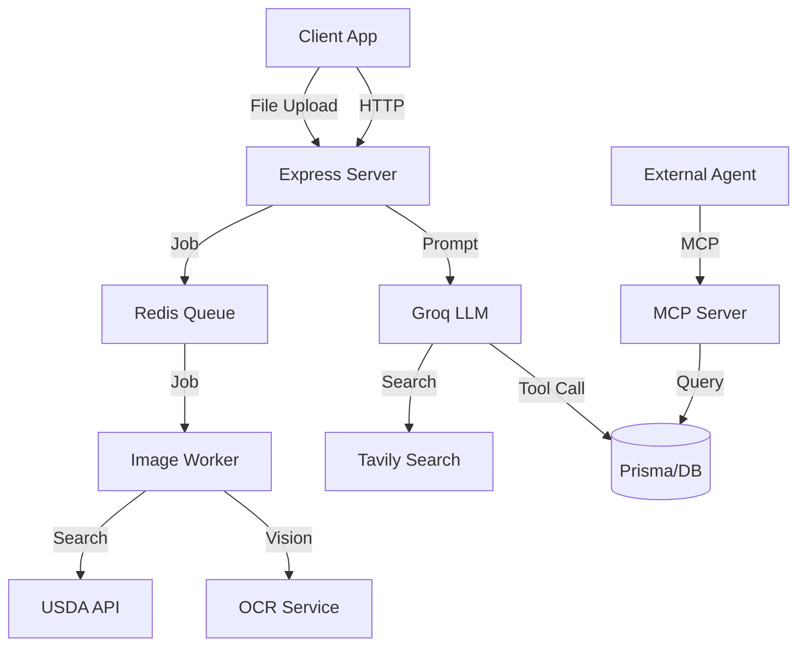

# AI Architecture & Pipeline

This document outlines the architectural flow of intelligence features in NutriAI, including image processing, background jobs, and external integrations.

## 1. High-Level Architecture
NutriAI follows a hybrid architecture:
- **Synchronous API**: Express.js handling immediate user requests.
- **Asynchronous Workers**: BullMQ (Redis) handling heavy lifting (OCR, Image Processing).
- **Agentic Layer**: Groq LLM + Tool calling for complex reasoning.
- **MCP Server**: Model Context Protocol integration for external agent access.

## 2. Image Processing Pipeline (OCR)
The flow for adding items via Receipt/Fridge photo:
1.  **Upload**: User Post to `/inventories/:id/items/from-image`.
2.  **Queue**: Controller adds a job to `image-queue` (BullMQ).
3.  **Worker (`image-worker.ts`)**:
    *   Pulls job.
    *   **Text Extraction**: Calls `ocrService` (likely wrapping a Vision LLM or specialized OCR).
    *   **Enrichment**: For each extracted text item, calls `usdaFoodService` to find nutritional matches.
    *   **Result**: Returns enriched items to the system (or logs to Audit/Notifications).
4.  **Feedback**: User polls job status or receives notification.

## 3. Background Jobs (BullMQ)
We use **BullMQ** backed by **Redis** for task management.
- **`image-queue`**: Handles Image -> Text -> Data conversion.
- **`audit-worker`**: (Inferred) Asynchronous logging of system events.
- **Redis Connection**: Configured in `config/queue.ts`.

## 4. Agentic AI Pipeline
How "Chat with NutriAI" works:
1.  **Input**: User query ("What should I cook with my expiring eggs?").
2.  **Orchestrator**: `AIAnalyticsService` constructs a prompt with system instructions.
3.  **LLM Inference (Groq)**: The model (`llama-3.3-70b`) analyzes the request.
4.  **Tool Decision**:
    *   LLM sees it needs inventory data -> Helper calls `get_inventories`.
    *   LLM sees it needs waste info -> Helper calls `predict_waste`.
5.  **Execution Loop**: The service executes the tools and feeds JSON results back to the LLM.
6.  **Synthesis**: LLM combines the tool data into a helpful response.

## 5. MCP (Model Context Protocol) Server
We run a dedicated MCP server to allow external AI assistants (like Claude Desktop) to interact with NutriAI context.
- **Port**: 3001 (default).
- **Transport**: SSE (Server-Sent Events).
- **Capabilities**:
    - `get_inventories`: Read inventory.
    - `create_inventory`: Make new lists.
    - `add_inventory_item`: Add items.
    - `consume_inventory_item`: Eat items.
    - `log_food_consumption`: Track diet.

## 6. External Integrations
- **Groq**: Provides the specific LLM inference. Selected for low latency.
- **Tavily**: Used for "live" web search (e.g., finding current article/video links for Resources).
- **USDA FDC API**: The source of truth for nutritional data.
- **Clerk**: Identity management, passing user context to the AI layer.

## 7. Data Flow Summary

